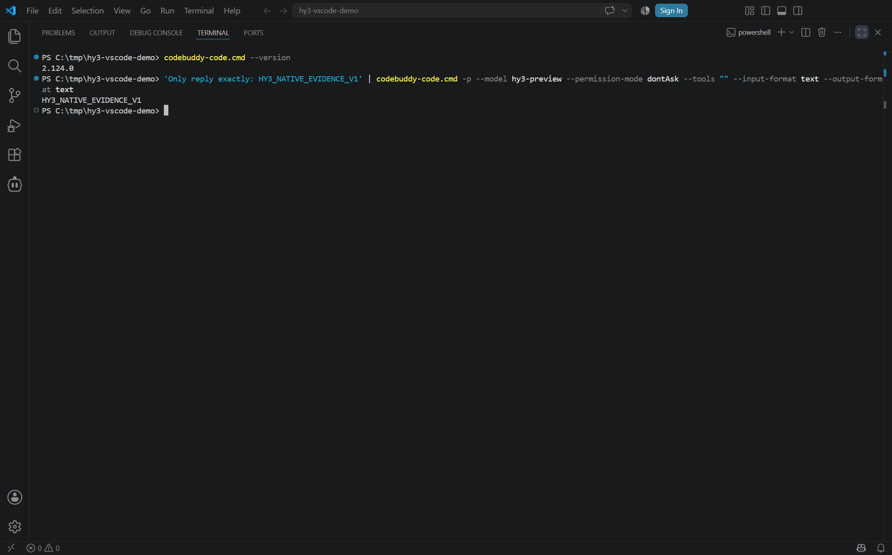
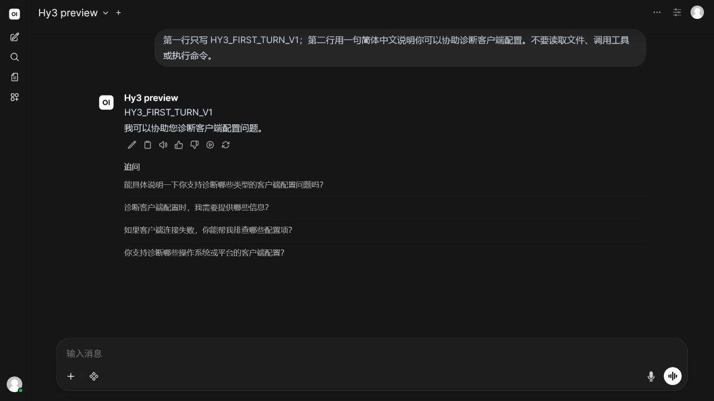
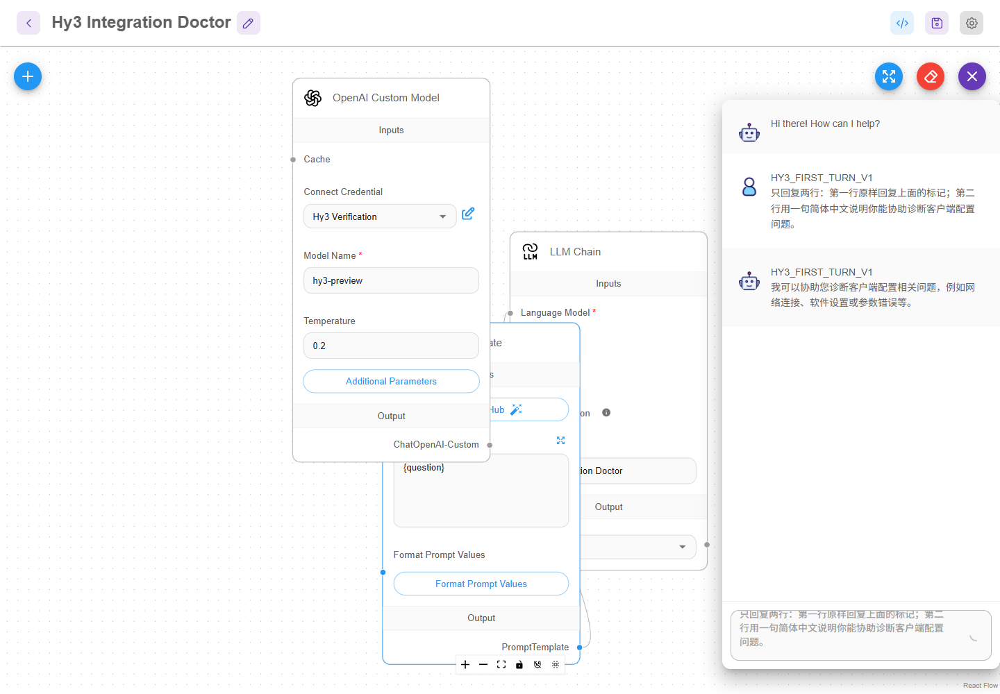

# Hy3 客户端接入指南

本目录记录 8 个产品在 2026-07-23 通过 OpenAI-compatible Chat Completions 接入 Hy3 的真实验证。所有产品使用同一份脱敏任务、同一组标记和实际模型 `hy3-preview`，并在第二个干净配置中复核。

## 3 分钟评审入口

- [机器可读清单：8 个产品、34 份媒体及其 SHA-256](verification/manifest.json)
- [8 个产品总览与逐项证据](#已验证产品)
- [Hy3 接入体检台 v0.1.3 Release](https://github.com/cai-56/hy3-integration-doctor/releases/tag/v0.1.3)
- [49.38 秒真实在线 GIF](https://github.com/cai-56/hy3-integration-doctor/blob/v0.1.3/demo/online-demo-v0.1.3.gif)
- [分支 CI：Windows / Linux × Python 3.10 / 3.14](https://github.com/cai-56/hy3-integration-doctor/actions/runs/30246114084)
- [v0.1.3 标签 CI：Windows / Linux × Python 3.10 / 3.14](https://github.com/cai-56/hy3-integration-doctor/actions/runs/30246207480)
- [安全边界：凭据、网络、脱敏与响应上限](https://github.com/cai-56/hy3-integration-doctor/blob/v0.1.3/docs/security.md)

## 已验证产品

| 产品 | 类别 | 版本 | 指南 | 在线记录 | 最佳截图 |
| --- | --- | --- | --- | --- | --- |
| CodeBuddy Code | CLI | 2.124.0 | [接入步骤](guides/codebuddy-code.md) | [在线记录](verification/records/codebuddy-code-2.124.0-2026-07-23.md) | [查看](assets/codebuddy-code/native-cli-online.png) |
| Aider | CLI | 0.86.2 | [接入步骤](guides/aider.md) | [在线记录](verification/records/aider-0.86.2-2026-07-23.md) | [查看](assets/aider/clean-reverification-online.jpg) |
| OpenCode | CLI | 1.18.3 | [接入步骤](guides/opencode.md) | [在线记录](verification/records/opencode-1.18.3-2026-07-23.md) | [查看](assets/opencode/first-turn-online.jpg) |
| Cline | IDE 扩展 | 4.0.10 | [接入步骤](guides/cline.md) | [在线记录](verification/records/cline-4.0.10-2026-07-23.md) | [查看](assets/cline/task-output-online.png) |
| Continue | IDE 扩展 | 2.0.0 | [接入步骤](guides/continue.md) | [在线记录](verification/records/continue-2.0.0-2026-07-23.md) | [查看](assets/continue/task-output-online.png) |
| Roo Code | IDE 扩展 | 3.54.0 | [接入步骤](guides/roo-code.md) | [在线记录](verification/records/roo-code-3.54.0-2026-07-23.md) | [查看](assets/roo-code/task-output-online.png) |
| Open WebUI | Web 客户端 | 0.10.1 | [接入步骤](guides/open-webui.md) | [在线记录](verification/records/open-webui-0.10.1-2026-07-23.md) | [查看](assets/open-webui/first-turn-online.jpg) |
| Flowise | 工作流平台 | 3.1.2 | [接入步骤](guides/flowise.md) | [在线记录](verification/records/flowise-3.1.2-2026-07-23.md) | [查看](assets/flowise/first-turn-online.png) |

覆盖 4 类产品：CLI、IDE 扩展、Web 客户端和工作流平台。

## 四类真实界面

CLI｜CodeBuddy Code 2.124.0：原生命令行显式选择 `hy3-preview`，并取得真实在线最小响应（2026-07-23）。



IDE｜Roo Code 3.54.0：Ask 模式在线完成统一诊断任务，画面保留 API Request、`HY3_TASK_V1` 与 Task Completed（2026-07-23）。


Web｜Open WebUI 0.10.1：选择 Hy3 preview 后，首轮在线响应命中 `HY3_FIRST_TURN_V1`（2026-07-23）。



工作流｜Flowise 3.1.2：OpenAI Custom Model、Prompt Template 与 LLM Chain 接入 `hy3-preview`，返回正文并命中首轮标记（2026-07-23）。



## 独立小作品

[Hy3 接入体检台 v0.1.3](https://github.com/cai-56/hy3-integration-doctor/releases/tag/v0.1.3)
用于排查客户端接入 Hy3 时的配置问题。它能离线检查 Base URL、模型 ID、鉴权位置和协议，
也能在用户明确开启在线模式后发送最小探针，并输出脱敏的中文修复步骤。

体检台不是简单的 API 转发器。Base URL、模型 ID、鉴权位置和协议问题由本地固定规则检查；在线探针只有在 HTTP 状态为 200、响应模型与预期模型完全一致、正文精确返回 `HY3_PROBE_OK` 时才算通过。`diagnose --live` 只让 Hy3 排序并解释已经脱敏、通过结构校验的本地发现；问题代码、参考项、修复配置和验证步骤仍受本地白名单与 Schema 约束。

- [固定版本源码](https://github.com/cai-56/hy3-integration-doctor/tree/v0.1.3)
- [49.38 秒在线演示](https://github.com/cai-56/hy3-integration-doctor/blob/v0.1.3/demo/online-demo-v0.1.3.gif)
- [安装、命令和安全边界](https://github.com/cai-56/hy3-integration-doctor/blob/v0.1.3/README.md)


## 通用配置

服务字段在不同产品中的名称不同，但验证契约一致：

```text
Base URL: <HY3_BASE_URL>/v1
Model: hy3-preview
API Key: <HY3_API_KEY>
Protocol: openai-compatible-chat-completions
```

`<HY3_BASE_URL>` 和 `<HY3_API_KEY>` 是文档占位符。不要把真实 Key 写入命令、配置示例、issue、日志或截图。具体产品如何从环境变量或本地加密凭据读取 Key，请以对应指南为准。

## 证据标准

每个产品都保存了：

1. 精确安装版本与方式；
2. 首轮真实在线响应标记 `HY3_FIRST_TURN_V1`；
3. 统一任务标记 `HY3_TASK_V1`；
4. 修正后的占位符配置、两个根因和一个验证步骤；
5. 产品身份、版本、实际模型或在线状态的真实截图；
6. 第二个干净配置或隔离状态下的复核；
7. 基于真实安装或调用失败的排障记录。

统一提示词见 [verification/task.md](verification/task.md)。机器可读清单见 [verification/manifest.json](verification/manifest.json)。

## 校验证据

在仓库根目录运行：

```powershell
python docs/integrations/scripts/check_integrations.py `
  --manifest docs/integrations/verification/manifest.json

python -m unittest discover -s docs\integrations\scripts\tests -v
```

校验器检查 7+ 产品、4+ 类别、唯一 ID、日期、实际模型、协议、在线模式、首轮/任务标记、
文档路径、媒体类型、证明字段、媒体 SHA-256、统一任务 SHA-256、运行时证据 JSON 的
字段交叉核对及自身 SHA-256，以及路径越界。单元测试只依赖 Python 标准库。

## 阅读证据时的边界

- 截图来自真实产品界面，不是脚本绘制的示意图。
- 清单中的 `mode` 均为 `online`；离线 fixture 不计入产品数量。
- 各客户端的工具能力不同。统一任务不调用工具，避免把工具协议差异混入基础端点验证。
- OpenCode 的 npm 包与本地服务器版本为 1.18.3，内置 Web UI 设置页显示 Desktop 1.18.2；记录中分别标注。
- Flowise 3.1.2 在本次 Node.js 22 环境需要固定 `connect-sqlite3@0.9.15`。部分未使用的 ReAct Agent 节点有 LangChain 导出警告，不影响本次 LLM Chain。
- 这些记录证明列出的版本和环境在验证日期成功，不承诺未来版本保持相同字段或默认行为。
