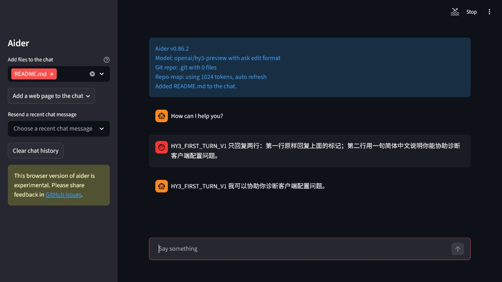
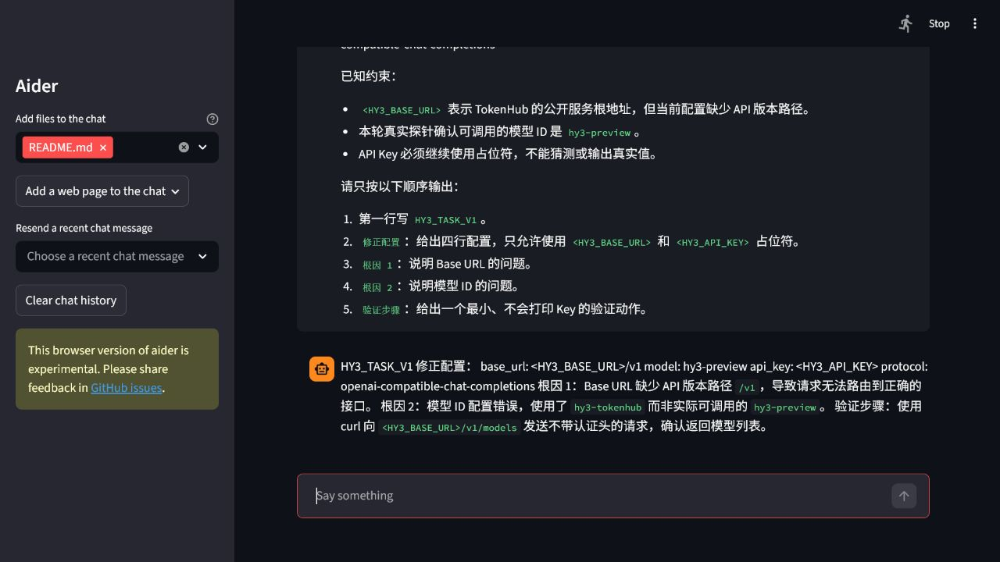

# Aider 接入 Hy3

本文记录 Aider `0.86.2` 在 Windows 上通过 OpenAI-compatible Chat Completions 接入 Hy3 的实测步骤。实际在线模型为 `hy3-preview`，证据使用 Aider 自带的浏览器界面。

## 安装

Aider `0.86.2` 的运行时使用 Python `3.12.13`。程序、Python 和缓存均放在 D 盘隔离目录：

```powershell
$env:HY3_CLIENTS_ROOT = 'D:\AI-Clients\hy3-issue-2'
$env:UV_TOOL_DIR = Join-Path $env:HY3_CLIENTS_ROOT 'uv-tools'
$env:UV_TOOL_BIN_DIR = Join-Path $env:HY3_CLIENTS_ROOT 'uv-bin'
$env:UV_CACHE_DIR = Join-Path $env:HY3_CLIENTS_ROOT 'uv-cache'
$env:UV_PYTHON_INSTALL_DIR = Join-Path $env:HY3_CLIENTS_ROOT 'uv-python'

uv tool install --python 3.12 'aider-chat==0.86.2'
uv pip install `
  --python (Join-Path $env:UV_TOOL_DIR 'aider-chat\Scripts\python.exe') `
  'aider-chat[browser]==0.86.2'
```

第二条命令补齐 Aider 官方 browser extra；没有把依赖安装到系统 Python。

## 准备公开演示仓库

Aider 的浏览器界面要求 Git 仓库。使用只含公开 README 的临时目录，不要把私有项目加入聊天：

```powershell
New-Item -ItemType Directory -Force -Path 'C:\tmp\hy3-aider-gui-clean'
Set-Location -LiteralPath 'C:\tmp\hy3-aider-gui-clean'
git init
Set-Content -LiteralPath 'README.md' -Encoding UTF8 `
  -Value '# Hy3 Aider public demo'
git add -- README.md
```

README 需要先被 Git 跟踪；无需创建提交。

## 配置与启动

`HY3_API_KEY` 和 `HY3_BASE_URL` 必须已存在于用户环境变量。Key 只在进程环境中复制，不写入参数或文件：

```powershell
$env:OPENAI_API_KEY = $env:HY3_API_KEY
$env:OPENAI_API_BASE = $env:HY3_BASE_URL
$env:STREAMLIT_SERVER_ADDRESS = '127.0.0.1'
$env:STREAMLIT_SERVER_PORT = '18082'
$env:STREAMLIT_SERVER_HEADLESS = 'true'
$env:STREAMLIT_BROWSER_GATHER_USAGE_STATS = 'false'

& (Join-Path $env:UV_TOOL_BIN_DIR 'aider.exe') `
  --gui `
  --model 'openai/hy3-preview' `
  --edit-format 'ask' `
  --no-analytics `
  --no-check-update `
  --no-show-release-notes `
  --no-show-model-warnings `
  --no-check-model-accepts-settings `
  --input-history-file 'NUL' `
  --chat-history-file 'NUL' `
  --llm-history-file 'NUL' `
  'README.md'
```

| 字段 | 值 |
| --- | --- |
| Base URL | 用户环境变量 `HY3_BASE_URL`，完整 API 前缀以 `/v1` 结尾 |
| Model | `openai/hy3-preview` |
| API Key | 用户环境变量 `HY3_API_KEY` |
| 协议 | OpenAI-compatible Chat Completions |
| Edit format | `ask`，本次只验证文本诊断，不允许自动改文件 |
| 模式 | 在线 |

打开 `http://127.0.0.1:18082`。页面顶部状态块应同时显示 Aider 版本、模型和 `ask edit format`。

## 首轮与统一任务

首轮提示和统一任务均逐字取自 [`verification/task.md`](../verification/task.md)。



统一任务响应命中 `HY3_TASK_V1`，包含占位符配置、Base URL 根因、模型根因和一个不打印 Key 的验证动作。



## 干净配置复验

第二次验证使用另一个新建 Git 仓库、单独的 Streamlit 端口以及禁用的输入、聊天和 LLM 历史文件。再次发送相同首轮提示后，响应命中 `HY3_FIRST_TURN_V1`。


## 实测排障

- `--gui --no-browser` 会回到终端模式，因为这两个参数是同一布尔选项的正反形式；启动浏览器界面时只使用 `--gui`，由 Streamlit 的 headless 设置阻止自动打开外部浏览器。
- 基础安装不含 browser extra 时，Aider 会交互询问是否安装。先用 uv 把 `aider-chat[browser]` 安装进同一工具环境，避免不可复现的交互安装。
- 浏览器界面不能与 `--no-git` 同用。必须在一个真实 Git 仓库中启动。
- 启动参数指定了未跟踪文件时，Streamlit `1.54.0` 会报告默认值不在文件选项中；先 `git add` 公开文件即可，无需提交。
- 未指定 `--edit-format ask` 的一次试验把首轮标记当成文件名。该结果没有作为证据；最终验证固定为 `ask`。

## 停止与清理

先停止对应 Streamlit 端口的 Aider 进程。隔离安装可用 `uv tool uninstall aider-chat` 卸载。临时演示仓库应在确认绝对路径后单独处理，不要把清理命令指向工作区或用户目录。
