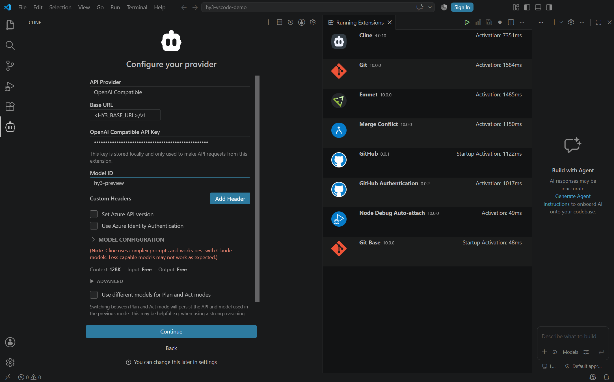
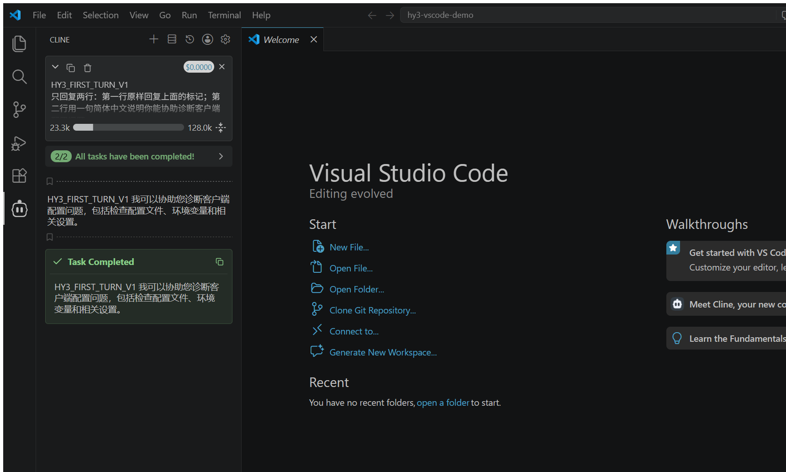
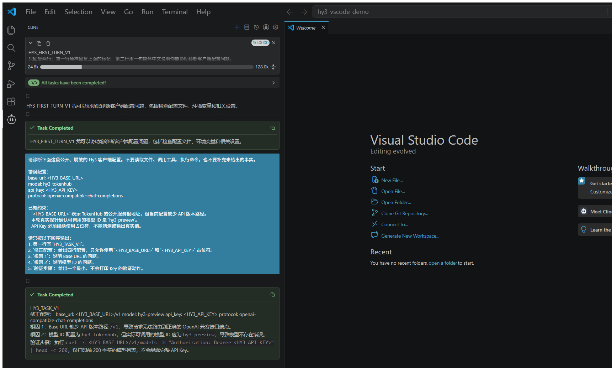
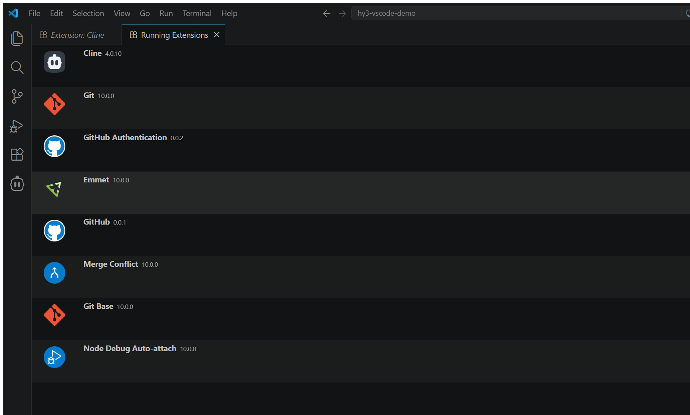
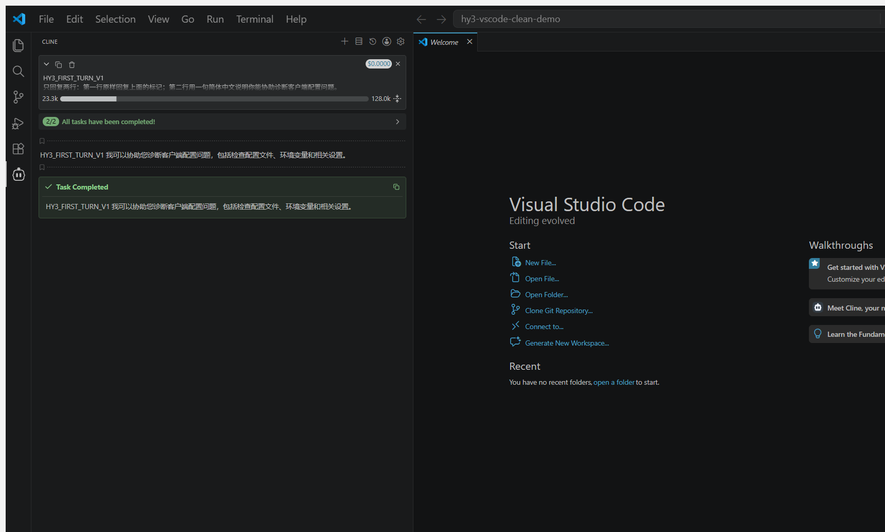

# Cline 接入 Hy3

本文记录 Cline `4.0.10` 在 Visual Studio Code 中通过 OpenAI-compatible Chat Completions 接入 Hy3 的实测步骤。实际在线模型为 `hy3-preview`。

## 安装

为避免占用系统盘，本次使用 Visual Studio Code `1.130.0` 的官方 Windows x64 archive、D 盘扩展目录和独立 portable 状态目录：

```powershell
$env:HY3_CLIENTS_ROOT = 'D:\AI-Clients\hy3-issue-2'
$env:VSCODE_PORTABLE = Join-Path $env:HY3_CLIENTS_ROOT 'vscode-profiles\cline-portable'

& (Join-Path $env:HY3_CLIENTS_ROOT 'vscode-portable\Code.exe') `
  --extensions-dir (Join-Path $env:HY3_CLIENTS_ROOT 'vscode-extensions') `
  --install-extension 'saoudrizwan.claude-dev@4.0.10'
```

本机已有 VS Code 正在执行官方更新，安装器持有全局 `vscode-updating` mutex。为了不终止用户正在使用的 VS Code，本次只在下载的 archive 副本中把 `product.json` 的 `win32MutexName` 改为隔离名称，并关闭该副本的 versioned updater；扩展包、Cline 代码和网络请求路径均未修改。

## 准备公开测试工作区

只打开不含私有代码的临时目录：

```powershell
New-Item -ItemType Directory -Force -Path 'C:\tmp\hy3-vscode-demo'
```

首次打开时选择 **Trust**。验证提示明确禁止读取文件、调用工具和执行命令；本轮 Cline 没有产生文件变更或终端调用。

## 配置

打开 Cline，选择：

1. **Bring my own API key**
2. **API Provider → OpenAI Compatible**
3. **Base URL**：用户环境变量 `HY3_BASE_URL` 的值，完整 API 前缀以 `/v1` 结尾
4. **OpenAI Compatible API Key**：用户环境变量 `HY3_API_KEY` 的值
5. **Model ID**：`hy3-preview`

| 字段 | 值 |
| --- | --- |
| Provider | OpenAI Compatible |
| Base URL | `HY3_BASE_URL`，完整 API 前缀 |
| Model ID | `hy3-preview` |
| API Key | `HY3_API_KEY` |
| 协议 | OpenAI-compatible Chat Completions |
| 模式 | 在线 |

不要截取配置页中的 Key。Cline 把 Key 存入 VS Code secret storage；仓库中不保存设置文件、数据库或日志副本。

下图来自 Cline `4.0.10` 的真实 Provider 表单。取证时只在未提交的表单中把 Base URL 显示为公开占位符，并填写公开模型 ID；API Key 保持产品自身的掩码显示，随后通过 **Back** 放弃表单，没有覆盖实际运行配置。



## 首轮与统一任务

首轮提示和统一任务均逐字取自 [`verification/task.md`](../verification/task.md)。Cline 的 Markdown 渲染会把同一段中的单换行显示为空格，因此截图里的两行回复在视觉上连成一行；响应标记和中文说明均完整。



统一任务响应命中 `HY3_TASK_V1`，给出占位符配置、两个根因和不输出真实 Key 的最小验证动作。



运行中扩展页确认 Cline 版本为 `4.0.10`。



## 干净状态复验

复验前创建另一个全新的 `VSCODE_PORTABLE` 根和公开临时工作区。新状态中没有 Cline 最近会话；Cline 从系统 secret storage 重新关联既有 provider 凭据，但没有复制首个 portable 根的聊天记录。相同首轮提示再次在线命中 `HY3_FIRST_TURN_V1`。



## 实测排障

- 当系统 VS Code 正在升级时，官方 archive 也会等待相同的 Inno Setup mutex。使用隔离 archive 身份可避免终止用户进程；这是启动层隔离，不是对 Cline 的功能修改。
- 未信任工作区时，Cline 被 Restricted Mode 限制。应先只对公开临时目录授予信任。
- VS Code 欢迎引导和 Workspace Trust 页会遮挡扩展 Webview；完成引导并关闭信任页后再配置。
- Cline 的 Webview 是 out-of-process iframe。自动化复验通过该真实 Webview 和 Chromium DevTools Protocol 操作，没有替换响应或伪造界面。
- Cline 在任务完成卡片中会重复展示最终文本；记录中的“实际输出”按响应正文去重。

## 停止与清理

停止前先确认进程可执行文件位于隔离 archive。临时 portable 根可能包含加密凭据引用和会话状态，应在证据确认后按精确绝对路径清理，不要对工作区根或用户目录执行递归删除。
