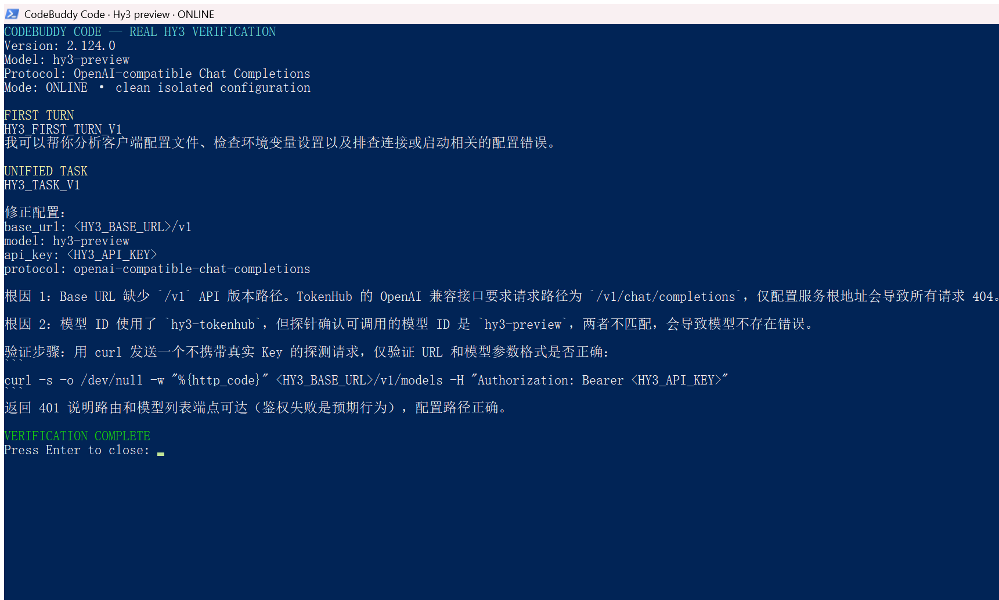

# CodeBuddy Code 接入 Hy3

本文记录 CodeBuddy Code `2.124.0` 在 Windows 上通过 OpenAI-compatible Chat Completions 接入 Hy3 的实测步骤。实际在线模型为 `hy3-preview`。

## 安装与版本

本机在任务开始前已安装用户级 npm 包 `@tencent-ai/codebuddy-code@2.124.0`，本次没有重复安装。可执行入口的真实 Node 命令返回：

```text
2.124.0
```

新环境可固定版本安装：

```powershell
npm install --global '@tencent-ai/codebuddy-code@2.124.0'
```

## 隔离配置

为 `CODEBUDDY_CONFIG_DIR` 指定一个新目录，并创建 `models.json`。运行文件需要真实服务 URL，公开文档继续使用占位符：

```json
{
  "models": [
    {
      "id": "hy3-preview",
      "name": "Hy3 Preview via TokenHub",
      "vendor": "Tencent Cloud TokenHub",
      "apiKey": "${HY3_API_KEY}",
      "url": "<HY3_BASE_URL>/v1/chat/completions",
      "maxInputTokens": 128000,
      "maxOutputTokens": 4096,
      "supportsToolCall": false,
      "supportsImages": false,
      "supportsReasoning": false
    }
  ],
  "availableModels": [
    "hy3-preview"
  ]
}
```

| 字段 | 值 |
| --- | --- |
| Endpoint | `<HY3_BASE_URL>/v1/chat/completions` |
| Model | `hy3-preview` |
| API Key | `${HY3_API_KEY}` |
| 协议 | OpenAI-compatible Chat Completions |
| 工具调用 | 本次关闭，不写成已验证能力 |
| 模式 | 在线 |

## 执行方式

首轮提示和统一任务均逐字取自 [`verification/task.md`](../verification/task.md)，以无 BOM UTF-8 字节写入标准输入。关键参数为：

```text
-p
--model hy3-preview
--permission-mode dontAsk
--tools ""
--input-format text
--output-format text
```

Key 由 `HY3_API_KEY` 环境变量解析，没有放进参数、提示、输出或截图。不要把多行提示直接拼到 PowerShell 的 `-p` 参数中。

## 真实结果

同一个真实终端画面包含产品名、真实版本、实际模型、在线模式、首轮响应、统一任务响应和干净配置标记：



统一任务命中 `HY3_TASK_V1`，给出了完整占位符配置、两个根因和一个使用占位符鉴权头的最小 HTTP 状态检查。

另一次补充取证直接在原生终端运行 `codebuddy-code.cmd --version`，再用 `--model hy3-preview`、空工具列表和文本输出发出最小在线请求。终端保留了真实命令、`2.124.0` 和原始响应 `HY3_NATIVE_EVIDENCE_V1`，没有显示 Key 或实际端点。该补充请求只用于证明 CLI 入口、版本、模型参数和在线响应来源，不替代冻结任务的计数结果。


## 干净配置复验

首次在线调用使用一个隔离 `CODEBUDDY_CONFIG_DIR`。取证前另建第二个只含 `models.json` 和最小 `user-state.json` 的目录，重新执行首轮和统一任务；终端顶部的 `clean isolated configuration` 对应第二次运行。两个目录没有共享会话文件。

## 实测排障

- PowerShell 把多行提示直接传给 `-p` 时，客户端只收到首行。使用标准输入传递完整 UTF-8 文本。
- PowerShell 默认管道编码曾使中文 JSONL 输入变成乱码。最终用无 BOM UTF-8 字节写入子进程标准输入。
- `-p --output-format json` 在本机一次运行中退出码为 0，但 stdout 为空；最终取证使用可观察的 `text` 输出。
- 一次开启工具能力的试验输出了工具标签文本。最终 `models.json` 关闭工具能力，命令同时使用 `--tools ""`。
- `codebuddy-code.ps1` 包装器会在子进程结束后调用 `exit`。自动化取证直接调用该包的真实 Node 入口，版本和运行逻辑没有替换。

## 清理

结束 CodeBuddy 进程后，只处理本次明确创建的两个隔离配置目录。不要递归删除用户现有 CodeBuddy 配置、npm 根目录或工作区。
