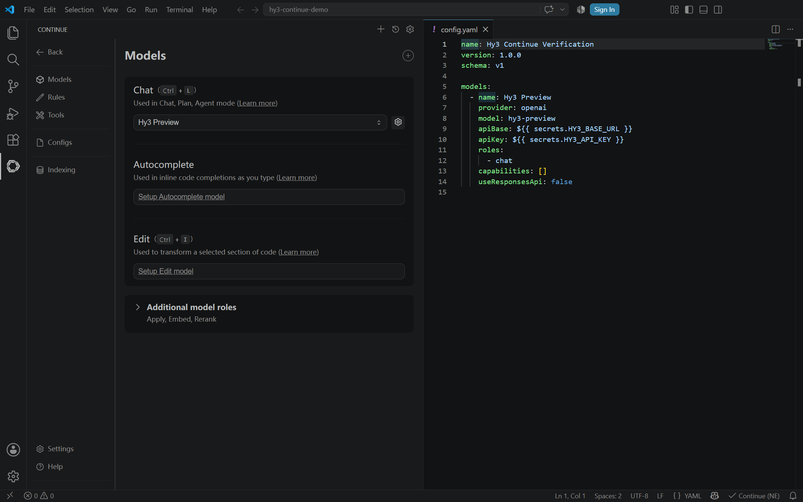
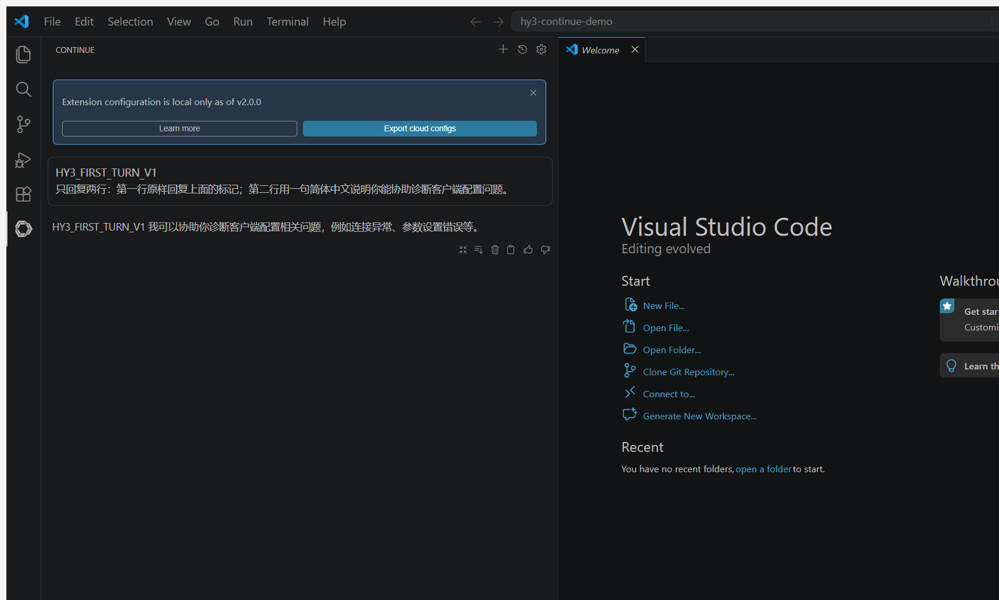
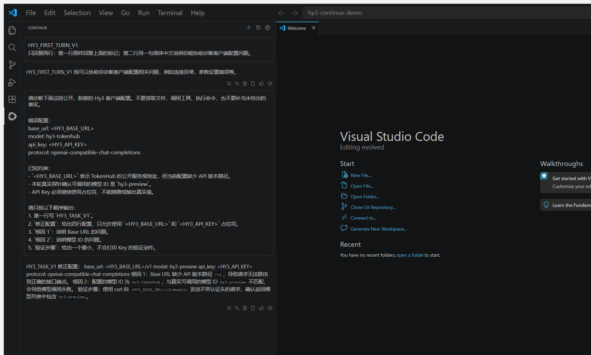
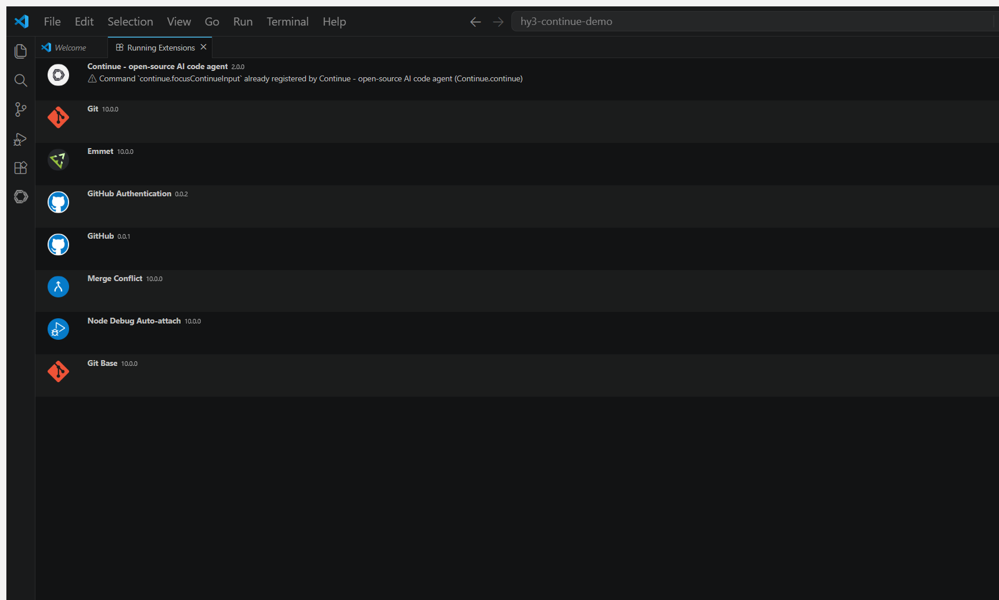
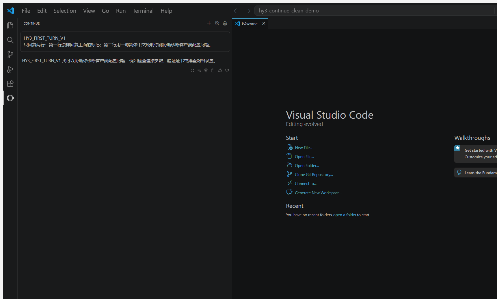

# Continue 接入 Hy3

本文记录 Continue `2.0.0` 在 Visual Studio Code 中通过 OpenAI-compatible Chat Completions 接入 Hy3 的实测步骤。实际在线模型为 `hy3-preview`。

## 安装与隔离目录

Continue 使用与其他 IDE 扩展相同的 D 盘扩展目录，但每次验证使用独立的 VS Code portable 状态根和 Continue 全局目录：

```powershell
$env:HY3_CLIENTS_ROOT = 'D:\AI-Clients\hy3-issue-2'
$env:VSCODE_PORTABLE = Join-Path $env:HY3_CLIENTS_ROOT 'vscode-profiles\continue-portable'
$env:CONTINUE_GLOBAL_DIR = Join-Path $env:HY3_CLIENTS_ROOT 'continue-main'

& (Join-Path $env:HY3_CLIENTS_ROOT 'vscode-portable\Code.exe') `
  --extensions-dir (Join-Path $env:HY3_CLIENTS_ROOT 'vscode-extensions') `
  --install-extension 'continue.continue@2.0.0'
```

验证使用 Visual Studio Code `1.130.0` official Windows x64 archive。archive 的启动隔离说明与 [Cline 指南](cline.md#安装)相同。

## 本地配置

Continue `2.0.0` 会显示 “Extension configuration is local only” 提示。本次把以下 `config.yaml` 放到 `CONTINUE_GLOBAL_DIR`，没有使用 Continue 云端配置：

```yaml
name: Hy3 Continue Verification
version: 1.0.0
schema: v1

models:
  - name: Hy3 Preview
    provider: openai
    model: hy3-preview
    apiBase: ${{ secrets.HY3_BASE_URL }}
    apiKey: ${{ secrets.HY3_API_KEY }}
    roles:
      - chat
    capabilities: []
    useResponsesApi: false
```

启动隔离 VS Code 进程前，把用户环境变量 `HY3_BASE_URL` 和 `HY3_API_KEY` 复制到该进程环境。配置文件只保存 secret 引用，不保存真实 Key。`useResponsesApi: false` 固定使用 Chat Completions；`roles: [chat]` 和空 capabilities 避免 Agent 工具调用。

Continue 的原生 **Models** 页显示 `Hy3 Preview`；同一窗口通过模型齿轮打开实际 `config.yaml`，可见 `provider: openai`、`model: hy3-preview`、两个 secret 引用、空 capabilities 和 `useResponsesApi: false`。截图隐藏了本地文件路径，没有改写配置。



## 在线验证

打开公开空目录并信任工作区。打开 Continue 后：

1. 关闭首次启动的 provider 推荐卡片；
2. Mode 选择 **Chat**；
3. Model 确认 **Hy3 Preview**；
4. 逐字发送 [`verification/task.md`](../verification/task.md) 中的首轮提示和统一任务。



Continue 的 Markdown 渲染把单换行显示为空格，但首轮标记和中文说明完整。统一任务响应命中 `HY3_TASK_V1`，并给出一个不带认证头的 `/v1/models` 探针。



运行中扩展页确认 Continue 版本为 `2.0.0`。



## 干净状态复验

复验使用全新的 `continue-clean` 和 `continue-clean-portable` 目录。首次打开 Continue 时会话搜索区域显示 `No results`，随后相同首轮提示再次在线命中 `HY3_FIRST_TURN_V1`。



## 实测排障

- Continue IDE 扩展默认使用 `%USERPROFILE%\.continue`；设置 `CONTINUE_GLOBAL_DIR` 可把配置、会话和缓存隔离到 D 盘。
- IDE 已经运行后再修改 shell 环境变量通常不会生效。本次在启动独立 VS Code 进程前设置 secret 环境变量，Continue 扩展宿主从该进程继承。
- 首次启动的 provider 推荐卡片会遮挡聊天区；本地 `Hy3 Preview` 已加载时可直接关闭它。
- 必须显式切换到 Chat，避免 Plan/Agent 模式附带文件或工具上下文。
- Running Extensions 页显示一条 `continue.focusContinueInput` 重复注册警告。真实聊天调用仍正常完成；该警告保留在版本证据中，没有隐藏。

## 清理

确认进程、`CONTINUE_GLOBAL_DIR` 和 `VSCODE_PORTABLE` 均位于本任务隔离根后再清理。仓库只保存脱敏文档和截图，不保存 Continue 状态库、日志或 Key。
