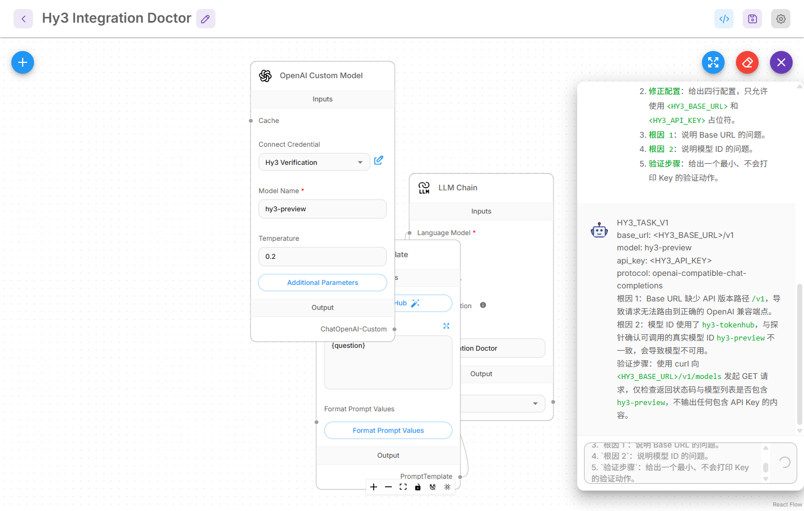
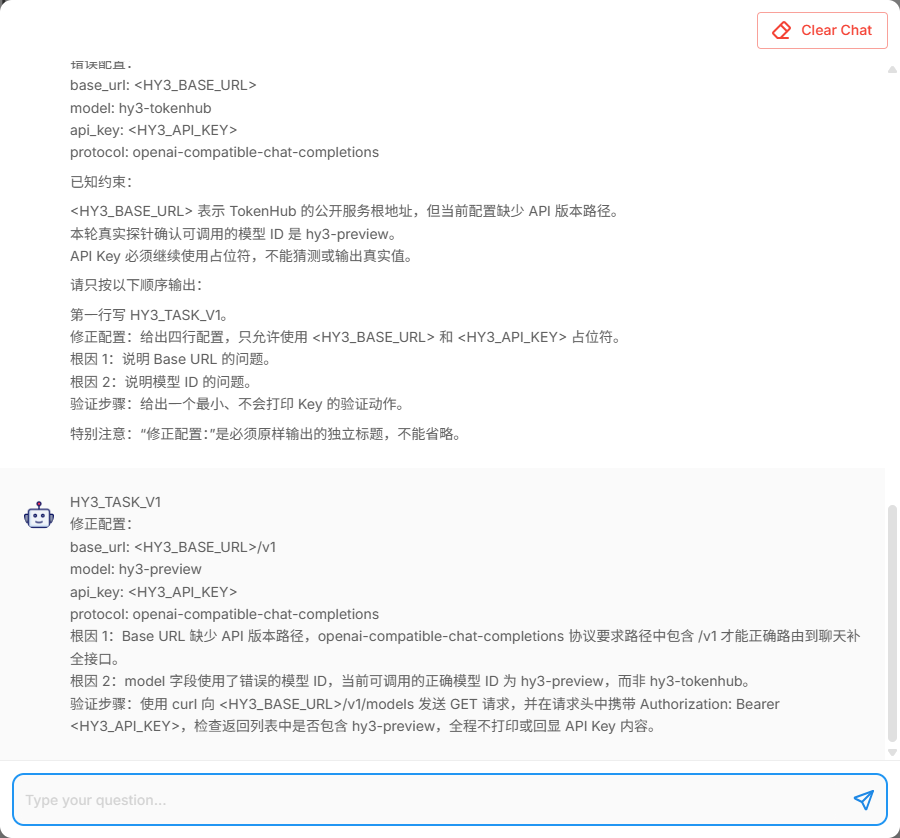
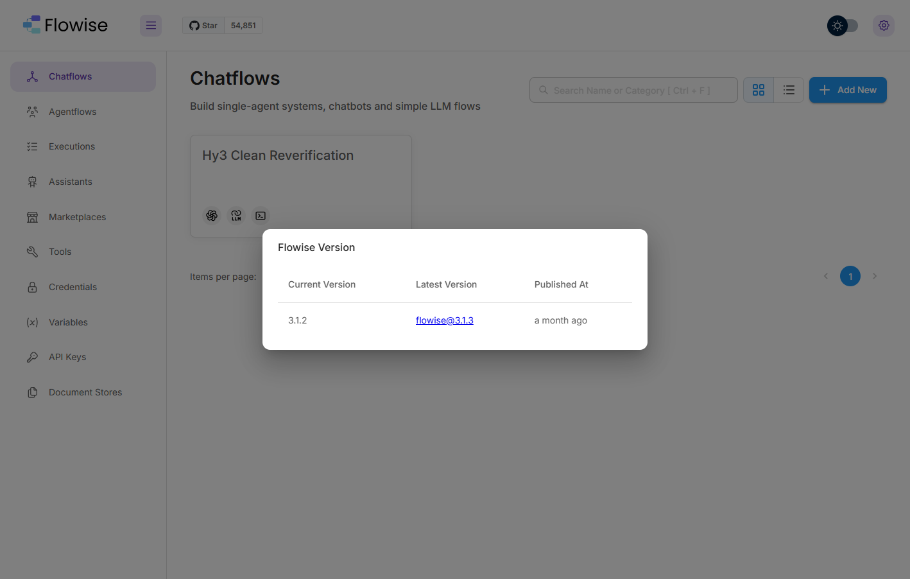
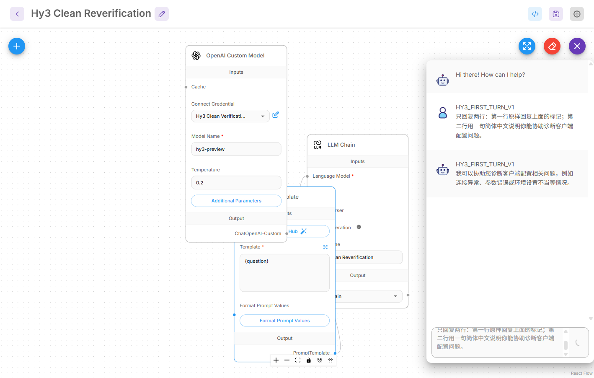

# Flowise 接入 Hy3

本文记录 Flowise `3.1.2` 在 Windows 上通过 OpenAI-compatible Chat Completions 接入 Hy3 的实测步骤。实际在线模型为 `hy3-preview`。

## 安装与 D 盘隔离

本次把程序、npm 缓存、数据库、加密密钥、上传目录和日志全部放在 D 盘：

```powershell
$env:HY3_CLIENTS_ROOT = 'D:\AI-Clients\hy3-issue-2'
$env:npm_config_cache = Join-Path $env:HY3_CLIENTS_ROOT 'npm-cache'

npm install `
  --prefix (Join-Path $env:HY3_CLIENTS_ROOT 'flowise-runtime') `
  'flowise@3.1.2'
```

当前依赖解析会把 Flowise 声明的 `connect-sqlite3@^0.9.15` 升到 `0.9.17`；该版本改变了数据库参数语义，启动时会报 `this.db.exec is not a function`。本次把它固定回声明范围内、与 Flowise 调用方式兼容的 `0.9.15`：

```powershell
npm install `
  --prefix (Join-Path $env:HY3_CLIENTS_ROOT 'flowise-runtime') `
  --no-save 'connect-sqlite3@0.9.15'
```

受当前网络对 GitHub Release 大文件传输的限制，实测安装先用 `--ignore-scripts` 展开依赖，再从经过大小和哈希检查的缓存启用 `better-sqlite3`、`sqlite3` 与 `sharp`。这是本机安装层处理，没有修改 Flowise 源码、前端资源或请求逻辑。网络正常时使用上面的标准安装命令即可。

## 启动

主验证使用 `18086` 端口：

```powershell
$env:FLOWISE_ROOT = Join-Path $env:HY3_CLIENTS_ROOT 'flowise-main'
$env:DATABASE_PATH = Join-Path $env:FLOWISE_ROOT 'database'
$env:SECRETKEY_PATH = Join-Path $env:FLOWISE_ROOT 'secrets'
$env:BLOB_STORAGE_PATH = Join-Path $env:FLOWISE_ROOT 'storage'
$env:LOG_PATH = Join-Path $env:FLOWISE_ROOT 'logs'
$env:HOST = '127.0.0.1'
$env:PORT = '18086'

& (Get-Command node).Source `
  (Join-Path $env:HY3_CLIENTS_ROOT 'flowise-runtime\node_modules\flowise\bin\run') `
  start
```

首次打开 `http://127.0.0.1:18086` 时创建本地管理员。管理员凭据只用于本机验证，不写入仓库。

## 配置凭据与 Chatflow

在 **Credentials → Add Credential → OpenAI API** 中创建凭据，把 `HY3_API_KEY` 的值填入 **OpenAI Api Key**。Flowise 使用 `SECRETKEY_PATH` 下的密钥加密凭据；不要截图 Key 输入框，也不要提交数据库、密钥或日志。

新建 Chatflow，并放置以下三个节点：

1. **OpenAI Custom Model**
2. **Prompt Template**
3. **LLM Chain**

节点配置如下：

| 字段 | 值 |
| --- | --- |
| Credential | 上一步创建的本地 OpenAI API 凭据 |
| Model Name | `hy3-preview` |
| Base Path | 环境变量 `HY3_BASE_URL`，完整前缀以 `/v1` 结尾 |
| Temperature | `0.2` |
| Prompt Template | `{question}` |
| 协议 | OpenAI-compatible Chat Completions |

把 **OpenAI Custom Model** 的输出连接到 **LLM Chain → Language Model**，把 **Prompt Template** 的输出连接到 **LLM Chain → Prompt**。本次 Chatflow 命名为 `Hy3 Integration Doctor`。

## 首轮与统一任务

首轮提示逐字取自 [`verification/task.md`](../verification/task.md)。Flowise 画布同时显示产品工作流、`hy3-preview`、首轮输入和真实在线响应。


同一 Chatflow 随后逐字执行统一任务。响应命中 `HY3_TASK_V1`，给出四行修正配置、两个根因和不会打印真实 Key 的验证动作。回答只使用公开占位符。



首个响应完整覆盖四行配置和诊断内容，但省略了要求中的字面标题“修正配置：”。为排除随机性，
将 Temperature 调整为 `0` 后重跑；模型仍省略该标题。因此保留原始证据，并在同一工作流中
追加一次透明的严格格式复验：重复完整任务，仅增加一句“该标题必须原样输出”的说明。复验响应
包含 `HY3_TASK_V1`、独立标题、四行配置、两个根因和验证步骤。



设置菜单中的 **Version** 对话框确认当前运行版本为 `3.1.2`。



## 干净配置复验

复验没有复制主实例数据库或密钥，而是使用此前不存在的第二组目录和端口：

```powershell
$env:FLOWISE_ROOT = Join-Path $env:HY3_CLIENTS_ROOT 'flowise-clean'
$env:DATABASE_PATH = Join-Path $env:FLOWISE_ROOT 'database'
$env:SECRETKEY_PATH = Join-Path $env:FLOWISE_ROOT 'secrets'
$env:BLOB_STORAGE_PATH = Join-Path $env:FLOWISE_ROOT 'storage'
$env:LOG_PATH = Join-Path $env:FLOWISE_ROOT 'logs'
$env:HOST = '127.0.0.1'
$env:PORT = '18087'
```

第二个实例首次打开显示 **Setup Account** 和 **No Chatflows Yet**。重新创建本地账户、加密凭据和三节点 Chatflow 后，相同首轮提示再次获得在线响应。



## 实测排障

- Flowise `3.1.2` 的包元数据声明 Node.js 18 或 20。本机依赖树在 2026-07-23 解析到若干要求 Node.js 22 的传递依赖，因此实际验证使用 Node.js `22.23.1`；npm 会显示 engine 警告。生产部署应优先使用 Flowise 官方当前支持的 Node 版本和锁定依赖。
- 当前解析到的部分 ReAct Agent 节点存在 LangChain 导出路径不匹配。启动日志会逐项跳过这两个节点，但随后明确记录 `Nodes pool initialized successfully` 和 `Flowise Server is listening`；本次使用的 OpenAI Custom Model、Prompt Template 与 LLM Chain 均正常加载。
- 在线文本已经完整返回后，聊天抽屉仍可能保持加载指示器。截图和服务器请求均证明响应来自真实在线调用；验证记录保留该现象，不把它改写成无警告成功。
- 当前网络无法稳定访问 LangChain 默认的 `tiktoken.pages.dev` 编码表，导致一次格式复验长时间
  等待。重启本地实例时使用临时 preload，仅从已安装的 `js-tiktoken` 包提供相同编码表；
  该处理只影响本地 token 计数，不修改 Flowise、任务文本或 Hy3 请求与响应。
- **Version** 对话框还会访问 Flowise 的 GitHub Releases 来显示最新版；当前版本值来自本机 `/api/v1/version`。

## 停止与清理

按监听端口和命令行确认进程属于本次 Flowise 实例后再停止。`flowise-main` 与 `flowise-clean` 含本地账户、加密凭据和会话数据，只能在确认绝对路径位于 `D:\AI-Clients\hy3-issue-2` 后单独清理；不要递归删除任务工作区或用户目录。
