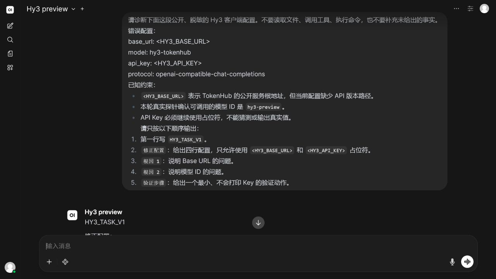
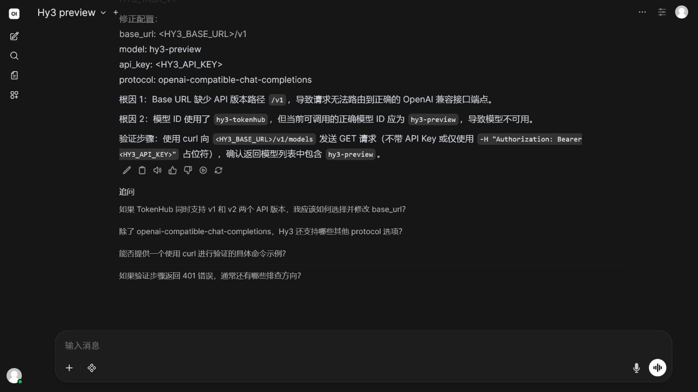
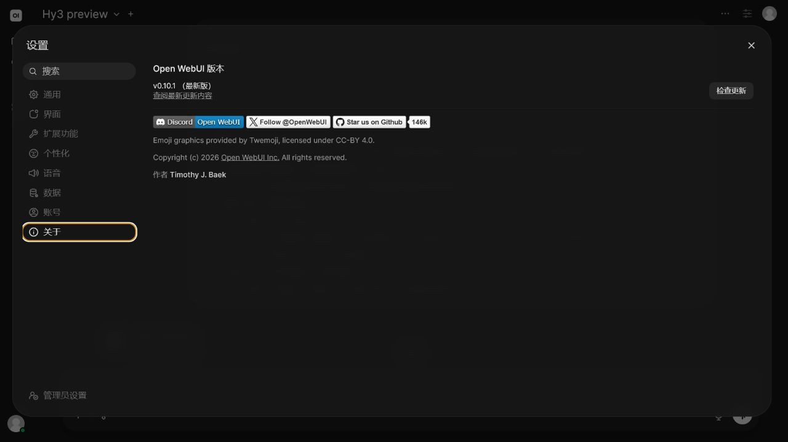
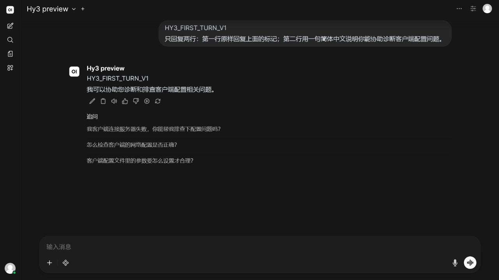

# Open WebUI 接入 Hy3

本文记录 Open WebUI `0.10.1` 在 Windows 上通过 OpenAI-compatible Chat Completions 接入 Hy3 的实测步骤。实际在线模型为 `hy3-preview`，验证日期为 2026-07-23。

## 安装

本次没有启动 Docker。为避免占用系统盘，使用 uv 的隔离工具目录和 Python `3.11.15`，把程序、解释器与缓存放在 D 盘：

```powershell
$env:HY3_CLIENTS_ROOT = 'D:\AI-Clients\hy3-issue-2'
$env:UV_TOOL_DIR = Join-Path $env:HY3_CLIENTS_ROOT 'uv-tools'
$env:UV_TOOL_BIN_DIR = Join-Path $env:HY3_CLIENTS_ROOT 'uv-bin'
$env:UV_CACHE_DIR = Join-Path $env:HY3_CLIENTS_ROOT 'uv-cache'
$env:UV_PYTHON_INSTALL_DIR = Join-Path $env:HY3_CLIENTS_ROOT 'uv-python'

uv tool install --python 3.11 'open-webui==0.10.1'
```

`open-webui --version` 在该版本不是有效子命令。版本通过 uv 工具清单、Python 包元数据和界面的“关于”页交叉确认。

## 配置与启动

`HY3_API_KEY` 和 `HY3_BASE_URL` 必须已存在于用户环境变量。`HY3_BASE_URL` 使用完整的 OpenAI-compatible API 前缀，以 `/v1` 结尾。下面的命令只复制环境变量，不打印 Key：

```powershell
$env:DATA_DIR = Join-Path $env:HY3_CLIENTS_ROOT 'open-webui-data'
$env:OPENAI_API_BASE_URL = $env:HY3_BASE_URL
$env:OPENAI_API_KEY = $env:HY3_API_KEY
$env:ENABLE_OLLAMA_API = 'False'
$env:ENABLE_PERSISTENT_CONFIG = 'False'
$env:WEBUI_AUTH = 'False'
$env:ENABLE_SIGNUP = 'False'
$env:ENABLE_MODEL_FILTER = 'True'
$env:MODEL_FILTER_LIST = 'hy3-preview'
$env:DEFAULT_MODELS = 'hy3-preview'

& (Join-Path $env:UV_TOOL_BIN_DIR 'open-webui.exe') serve `
  --host 127.0.0.1 `
  --port 18080
```

本次实测字段如下：

| 字段 | 值 |
| --- | --- |
| Base URL | 用户环境变量 `HY3_BASE_URL`，完整路径以 `/v1` 结尾 |
| Model ID | `hy3-preview` |
| API Key | 用户环境变量 `HY3_API_KEY` |
| 协议 | OpenAI-compatible Chat Completions |
| 运行模式 | 在线 |

服务启动后打开 `http://127.0.0.1:18080`，在模型下拉框中选择 **Hy3 preview**。

## 首轮调用

发送：

```text
HY3_FIRST_TURN_V1
只回复两行：第一行原样回复上面的标记；第二行用一句简体中文说明你能协助诊断客户端配置问题。
```

实际响应命中 `HY3_FIRST_TURN_V1`，并返回“我可以协助您诊断客户端配置问题。”


## 统一端到端任务

完整提示词以 [`verification/task.md`](../verification/task.md) 为准。响应命中 `HY3_TASK_V1`，给出了占位符配置、两个根因和一个验证步骤。





## 版本证据

“设置 → 关于”显示 `v0.10.1`。



## 干净配置复验

不要复用已有数据目录。为 `DATA_DIR` 指定一个新的空目录，保持其余进程环境变量不变，重新启动服务；选择 `hy3-preview` 后再次发送首轮标记。新的数据目录不会读取此前会话或缓存，因此可区分真实在线响应与历史记录。

本次在第二个全新 `DATA_DIR` 和独立端口上完成了复验，响应再次命中首轮标记：



## 实测排障

- 启动日志可能提示本地缺少 sentence-transformers 模型。该组件用于检索/嵌入，不阻断本次 Chat Completions 对话；若只验证聊天，可保持 Hugging Face 离线并关闭不需要的检索功能。
- `open-webui --version` 会报“不存在该命令”。请用包元数据和“关于”页确认版本。
- 若模型列表为空，先确认 `HY3_BASE_URL` 是以 `/v1` 结尾的完整 API 前缀，再确认模型过滤列表使用 `hy3-preview`。
- `hy3` 在本次最小探针中返回 HTTP 402 / `401008`；本指南只记录实际成功的 `hy3-preview`，不把两者混写。

## 停止与清理

先停止监听端口的 Open WebUI 进程。隔离安装可用 `uv tool uninstall open-webui` 卸载；数据目录应在确认绝对路径位于本次 `HY3_CLIENTS_ROOT` 后再单独清理，避免误删其他 Open WebUI 数据。
