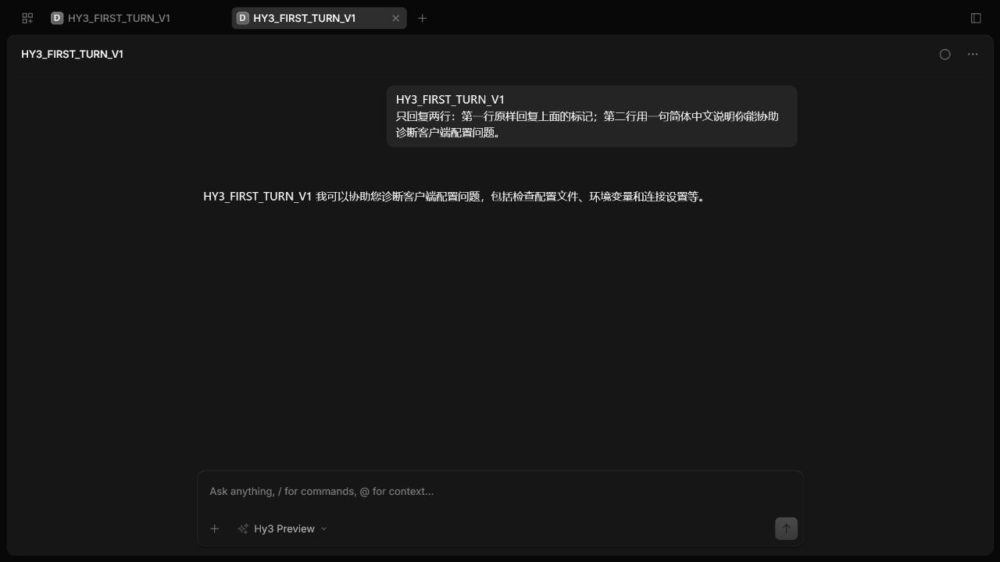
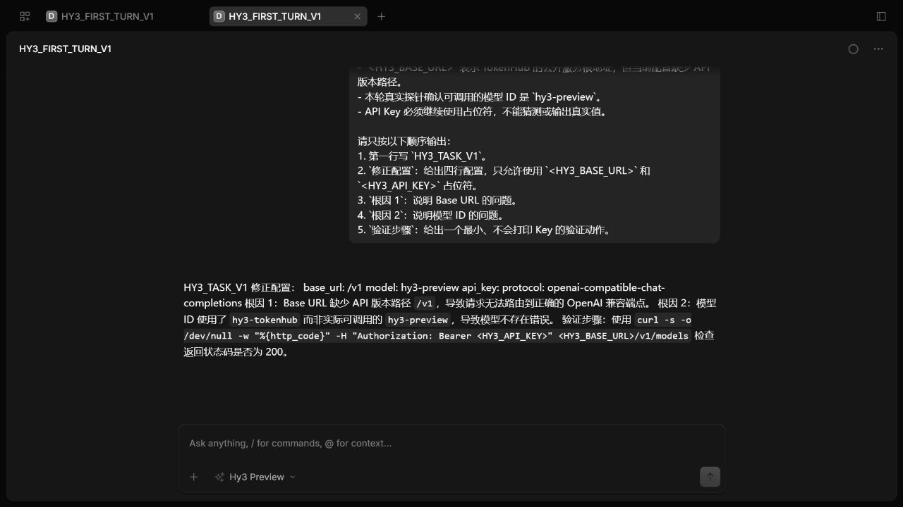
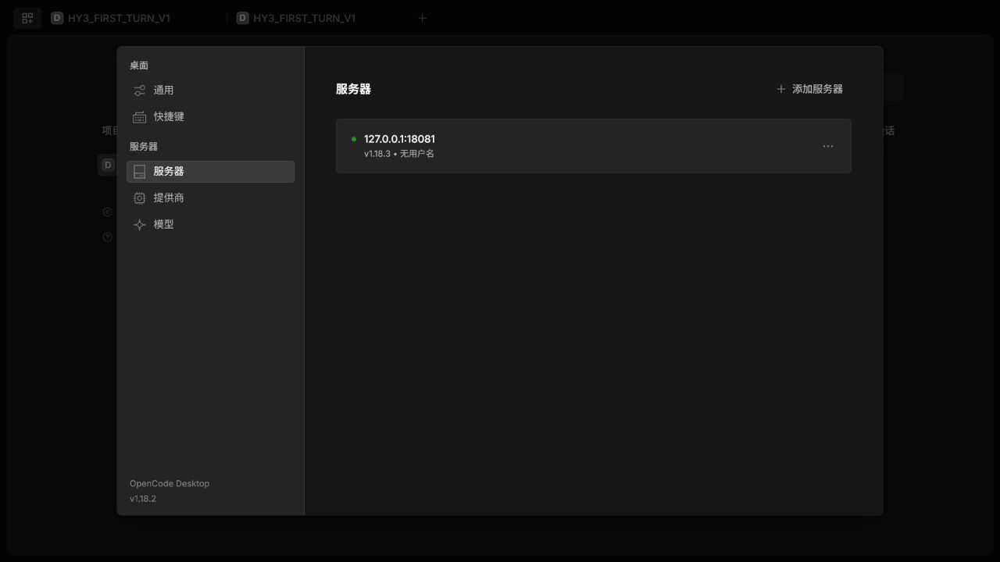
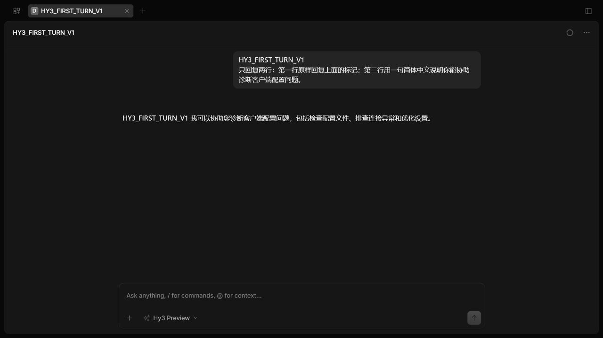

# OpenCode 接入 Hy3

本文记录 OpenCode `1.18.3` 在 Windows 上通过 OpenAI-compatible Chat Completions 接入 Hy3 的实测步骤。实际在线模型为 `hy3-preview`。安装包和本地服务器版本为 `1.18.3`；该版本内置 Web UI 的设置页同时显示 `OpenCode Desktop v1.18.2`，两者在记录中分开标注。

## 安装

使用独立 npm prefix 把程序放在 D 盘：

```powershell
$env:HY3_CLIENTS_ROOT = 'D:\AI-Clients\hy3-issue-2'
$env:NPM_CONFIG_PREFIX = Join-Path $env:HY3_CLIENTS_ROOT 'npm-prefix'
npm install --prefix $env:NPM_CONFIG_PREFIX 'opencode-ai@1.18.3'
```

实测可执行文件：

```text
D:\AI-Clients\hy3-issue-2\npm-prefix\node_modules\opencode-ai\bin\opencode.exe
```

## 配置

配置文件不保存 Key，只引用进程环境变量：

```json
{
  "$schema": "https://opencode.ai/config.json",
  "model": "hy3/hy3-preview",
  "small_model": "hy3/hy3-preview",
  "autoupdate": false,
  "share": "disabled",
  "enabled_providers": ["hy3"],
  "provider": {
    "hy3": {
      "npm": "@ai-sdk/openai-compatible",
      "name": "Hy3 TokenHub",
      "options": {
        "baseURL": "{env:HY3_BASE_URL}",
        "apiKey": "{env:HY3_API_KEY}",
        "timeout": 60000
      },
      "models": {
        "hy3-preview": {
          "name": "Hy3 Preview"
        }
      }
    }
  },
  "tools": {
    "bash": false,
    "edit": false,
    "write": false,
    "read": false,
    "grep": false,
    "glob": false,
    "list": false,
    "webfetch": false,
    "websearch": false,
    "task": false
  }
}
```

| 字段 | 值 |
| --- | --- |
| Base URL | `HY3_BASE_URL`，完整 API 前缀以 `/v1` 结尾 |
| Provider model | `hy3/hy3-preview` |
| 实际模型 | `hy3-preview` |
| API Key | `HY3_API_KEY` |
| Provider adapter | `@ai-sdk/openai-compatible` |
| 协议 | OpenAI-compatible Chat Completions |
| 模式 | 在线 |

## 启动官方 Web UI

把 OpenCode 的四个 XDG 状态目录全部放在 D 盘，避免默认状态写回系统盘：

```powershell
$stateRoot = Join-Path $env:HY3_CLIENTS_ROOT 'opencode-state'
$env:XDG_CONFIG_HOME = Join-Path $stateRoot 'config'
$env:XDG_DATA_HOME = Join-Path $stateRoot 'data'
$env:XDG_CACHE_HOME = Join-Path $stateRoot 'cache'
$env:XDG_STATE_HOME = Join-Path $stateRoot 'state'
$env:OPENCODE_CONFIG = 'C:\tmp\hy3-issue2-opencode\opencode.json'

Set-Location -LiteralPath 'C:\tmp\hy3-issue2-opencode\demo'
& (Join-Path $env:NPM_CONFIG_PREFIX 'node_modules\opencode-ai\bin\opencode.exe') `
  serve `
  --hostname 127.0.0.1 `
  --port 18081
```

打开 `http://127.0.0.1:18081`，选择“添加项目”，再选择只含公开 README 的临时 Git 仓库。模型选择器应显示 `Hy3 Preview`。

## 首轮与统一任务

首轮提示和统一任务均逐字取自 [`verification/task.md`](../verification/task.md)。



统一任务命中 `HY3_TASK_V1`，返回修正配置、两个根因和一个验证步骤：



OpenCode Web UI 的 Markdown 渲染器会把响应中的 `<HY3_BASE_URL>` 和 `<HY3_API_KEY>` 当作 HTML 标签隐藏，因此截图中 `base_url` 和 `api_key` 的值显示为空。相同提示在 OpenCode CLI 中显示了完整的字面占位符；这属于显示问题，不把空值写成模型实际输出。

## 版本证据

设置页的服务器标签同时显示本地服务器 `v1.18.3` 和 Web UI bundle `OpenCode Desktop v1.18.2`：



## 干净配置复验

第二次验证使用另一个临时 Git 仓库、全新的 D 盘 XDG 状态根、另一份无凭据配置文件和独立端口。重新添加项目并发送相同首轮提示后，响应再次命中 `HY3_FIRST_TURN_V1`。



## 实测排障

- 非 Git 目录会被服务器识别成全局项目，Web UI 首页可能显示“这里还没有内容”。在只含公开文件的临时目录执行 `git init`，再用“添加项目”选择该目录；无需创建提交。
- 只设置 `XDG_CONFIG_HOME`、`XDG_DATA_HOME` 和 `XDG_CACHE_HOME` 时，OpenCode 仍会把状态写到系统盘。还需要设置 `XDG_STATE_HOME`。
- Web UI bundle 与本地服务器版本号不完全相同。本次没有把 `v1.18.2` 误写成已安装 npm 包版本。
- 尖括号占位符在 Web UI 响应区被当作 HTML 标签隐藏。核验原始文本时使用 OpenCode CLI；文档和配置仍保留字面占位符。
- 工具能力在本次任务中全部关闭，避免把代码执行或文件访问误写成已验证能力。

## 停止与清理

先停止对应端口的 OpenCode 进程。npm 包可在确认 prefix 后从隔离目录卸载；XDG 状态目录和临时项目应分别核对绝对路径后处理，不要使用面向用户目录或工作区根目录的递归清理命令。
