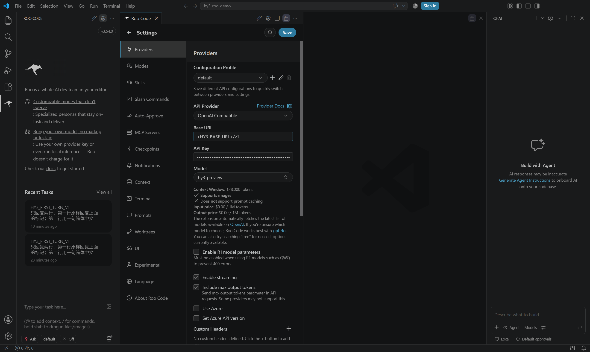
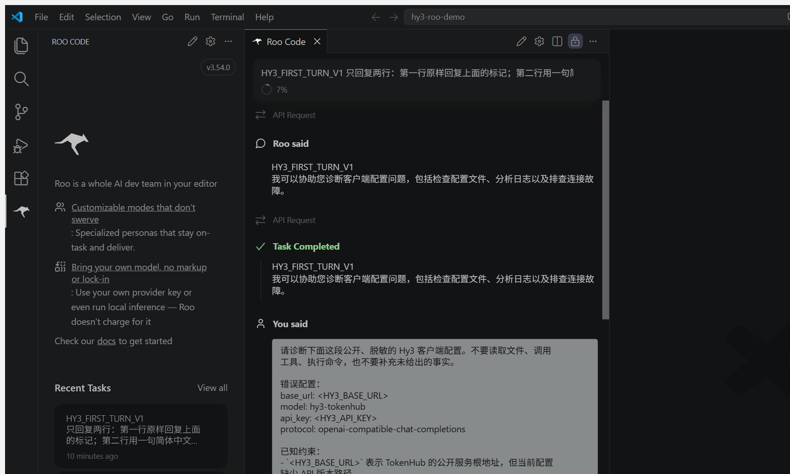
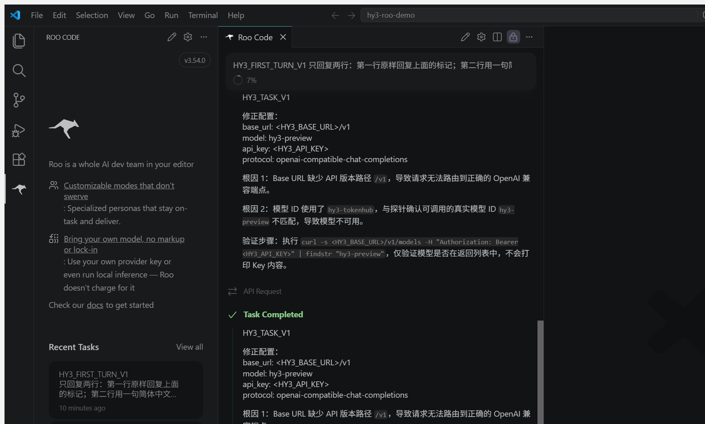
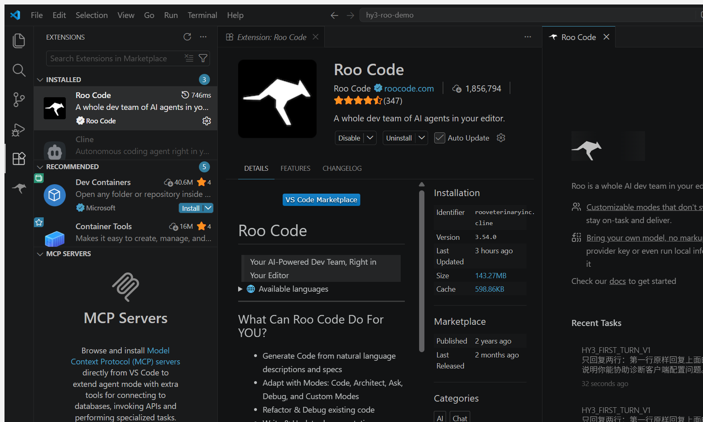
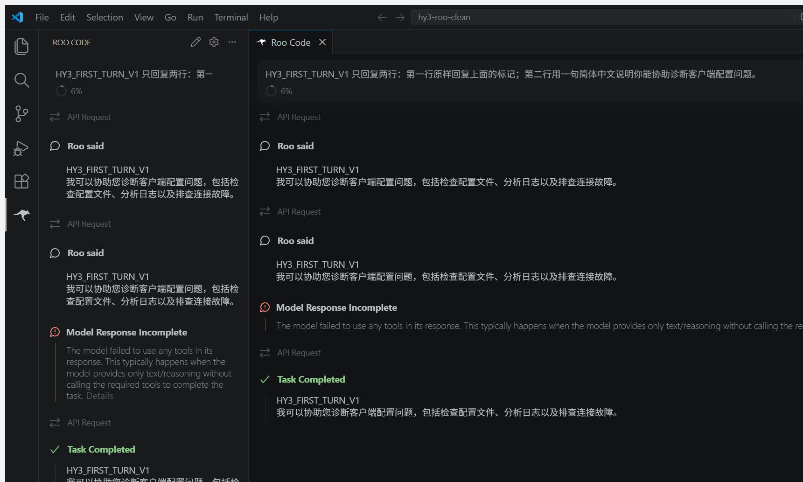

# Roo Code 接入 Hy3

本文记录 Roo Code `3.54.0` 在 Visual Studio Code 中通过 OpenAI-compatible Chat Completions 接入 Hy3 的实测步骤。实际在线模型为 `hy3-preview`。

## 安装

为避免占用系统盘，本次复用 D 盘中的 Visual Studio Code `1.130.0` 官方 Windows x64 archive、共享扩展目录和独立状态根：

```powershell
$env:HY3_CLIENTS_ROOT = 'D:\AI-Clients\hy3-issue-2'
$env:VSCODE_PORTABLE = Join-Path $env:HY3_CLIENTS_ROOT 'vscode-profiles\roo-portable'

& (Join-Path $env:HY3_CLIENTS_ROOT 'vscode-portable\Code.exe') `
  --extensions-dir (Join-Path $env:HY3_CLIENTS_ROOT 'vscode-extensions') `
  --install-extension 'rooveterinaryinc.roo-cline@3.54.0'
```

archive 的启动隔离与 [Cline 指南](cline.md#安装)相同：仅修改 archive 副本的 mutex 名和 updater 开关，不修改 Roo Code 扩展代码或请求路径。

Roo Code `3.54.0` 仍按旧版 VS Code 的 `@vscode/ripgrep/bin/rg.exe` 路径查找 ripgrep，而官方 VS Code `1.130.0` archive 把同一二进制放在 `@vscode/ripgrep-universal/bin/win32-x64/rg.exe`。本次把官方 archive 自带的 `rg.exe` 逐字节复制到旧兼容路径；源文件与副本 SHA-256 均为 `83439bf545d316fb761e84e3180d1dbd36a46bd65598f8dcee0e816c117a4ceb`。这是宿主兼容路径修复，没有修改 Roo Code 的产品代码。

## 准备公开测试工作区

只打开不含私有代码的空目录：

```powershell
New-Item -ItemType Directory -Force -Path 'C:\tmp\hy3-roo-demo'
```

首次打开时选择 **Trust**。统一提示明确禁止读取文件、调用工具或执行命令；主验证没有产生工具调用、终端命令或工作区文件变更。

## 配置

在 Roo Code 首次引导中选择：

1. **API Provider → OpenAI Compatible**
2. **Base URL**：用户环境变量 `HY3_BASE_URL` 的值
3. **API Key**：用户环境变量 `HY3_API_KEY` 的值
4. **Model → hy3-preview**
5. **Enable streaming**：开启
6. **Include max output tokens**：开启，值为 `-1`
7. **Mode → Ask**
8. **Auto-approve → Off**

| 字段 | 值 |
| --- | --- |
| Provider | OpenAI Compatible |
| Base URL | `HY3_BASE_URL` |
| Model ID | `hy3-preview` |
| API Key | `HY3_API_KEY` |
| 协议 | OpenAI-compatible Chat Completions |
| 模式 | 在线、Ask、Auto-approve Off |

Key 由 Roo Code 写入 VS Code secret storage。仓库不保存设置数据库、扩展日志或真实 Key。

下图来自 Roo Code `3.54.0` 的真实 Settings 页面，同时显示产品版本、OpenAI Compatible、`hy3-preview` 和掩码 Key。取证时临时把 Base URL 输入框替换为公开占位符，但没有点击 **Save**，随后退出设置页，因此没有覆盖运行配置。



## 首轮与统一任务

首轮提示和统一任务均逐字取自 [`verification/task.md`](../verification/task.md)。Roo Code 的 Markdown 视图把响应中的单换行显示为空格，但标记和中文说明完整。



同一会话中的统一任务命中 `HY3_TASK_V1`，返回占位符配置、两个根因和不会打印 Key 的最小验证动作。



Visual Studio Code 扩展详情页确认安装版本为 `3.54.0`。



## 干净状态复验

复验使用全新的 `roo-clean-portable` 状态根和 `C:\tmp\hy3-roo-clean` 空目录。首次打开扩展时显示 `Welcome to Roo Code!`，没有首个状态根的 Roo Code 最近任务；随后通过首次引导重新设置 provider 和模型，发送相同首轮提示。

复验再次得到正确标记和中文响应。Roo Code 随后显示 `Model Response Incomplete`，原因是该版本在纯文本响应后仍期待工具调用；用户提示明确禁止工具调用，所以保持 Ask 模式与 Auto-approve Off，不放宽权限。扩展在同一画面最终显示 `Task Completed`，且没有执行工具。



## 实测排障

- 未复制兼容二进制时，扩展宿主日志报告 `Could not find ripgrep binary`，任务停留在 `API Request`。补齐官方 ripgrep 的旧路径后，真实在线响应完成。
- 首次启动默认模式是 Architect。验证前应显式切换 Ask，并确认 Auto-approve 为 Off。
- Roo Code 会在完成卡片中再次显示最终文本；验证记录按响应正文去重。
- `3.54.0` 的内置公告说明它是 Roo Code 的最后一个版本，扩展不会再接收修复或模型更新。本文只记录已复现的当前行为，不把它推荐为长期维护方案。

## 停止与清理

停止前先确认进程可执行文件位于 D 盘隔离 archive。两个 portable 根可能包含加密凭据引用和会话状态；应按精确绝对路径清理，不要递归删除任务工作区或用户目录。
