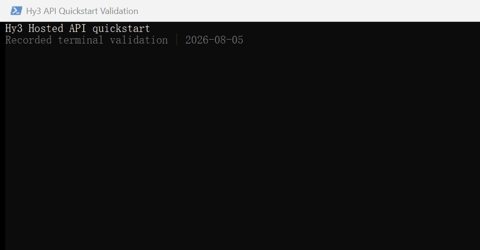

# Hy3 API 验证记录

最后更新：2026-08-05（Asia/Shanghai）

本页集中记录在线调用、离线测试、版本覆盖和隐私检查。历史结果保留原日期，不用新的
结果覆盖旧记录。



录屏通过真实 `Get-Content` / `rg` 命令读取本分支证据，并现场运行一次离线测试。
2026-08-05 的在线探针停在额度门禁；录屏中的六类在线结果均带有 2026-07-17 标签。

| GIF 检查项 | 结果 |
|---|---|
| 时长 / 帧数 | 34.50 秒 / 13 帧 |
| 尺寸 / 文件大小 | 960 × 500 / 472,260 bytes |
| SHA-256 | `9C75BF56FFE88E158D76B813BBF322A93AE378AAAA4221A0705DC247B624E33B` |
| 逐帧检查 | 13 帧全部检查；未出现 Key、endpoint、request ID、账号、个人路径或其他窗口 |

## 当前在线门禁

验证代码基线为 `ac446f3fe5173a783683a683276502908f7e8406`。本次后续改动只涉及
验证、文档和端口输入校验，六个示例的请求流程未改。

| 项目 | 结果 |
|---|---|
| 日期 | 2026-08-05 |
| 环境 | Windows 11 家庭版，build 26200 |
| Python | 3.13.5 |
| OpenAI SDK | 2.38.0 |
| jsonschema | 4.23.0 |
| 调用预算 | 先执行 1 个请求，`max_tokens=32`；额度、凭据或服务失败即停止 |
| HTTP | 402 |
| 业务码 | `401008` |
| requested model | `hy3` |
| actual model | 未返回 |
| 脱敏摘要 | 免费体验额度耗尽，当前服务未启用后付费 |
| 结论 | provider quota gate；请求停在模型生成前，示例与模型质量均未测 |

这次失败未保留 endpoint、headers、request ID、账号或 Key。探针确认共享额度门禁后，
六个脚本本轮未启动。

## 六类历史在线结果

以下结果采集于 2026-07-17，来自真实 TokenHub 调用。当时的采集器只保留 SDK 级结果，
所以 raw HTTP status 一栏写为“未记录”。`actual model` 也只填写响应输出中确实保留的值。

| 示例 | 命令 | HTTP | requested model | actual model | 脱敏结果 | 结论 |
|---|---|---:|---|---|---|---|
| [01 基础对话](01_basic_chat.md) | `python examples/api/01_basic_chat.py` | 未记录 | `hy3` | `hy3` | 单轮与多轮均为 `finish_reason=stop`，保留 usage | 通过 |
| [02 流式输出](02_streaming.md) | `python examples/api/02_streaming.py` | 未记录 | `hy3` | 未记录 | 收到首个 content chunk，最终 `complete=true` 并保留 usage | 通过 |
| [03 时延对比](03_latency_compare.md) | `python examples/api/03_latency_compare.py --runs 5 --warmup 1` | 未记录 | `hy3` | 未记录 | non-stream P50 2.074 s；stream TTFT P50 0.666 s；stream total P50 1.726 s | 通过；仅为客户端样本 |
| [04 工具调用](04_tool_calling.md) | `python examples/api/04_tool_calling.py` | 未记录 | `hy3` | `hy3` | 首轮 `tool_calls`，执行 `convert_temperature` 后第二轮 `stop` | 通过 |
| [05 思考模式](05_reasoning_mode.md) | `python examples/api/05_reasoning_mode.py` | 未记录 | `hy3` | 未记录 | off/low/medium/high 四档均返回 `stop`，分别解析 reasoning 与 answer | 通过；单次样本不代表质量 |
| [06 错误重试](06_error_handling_retry.md) | `python examples/api/06_error_handling_retry.py` | 未记录 | `hy3` | `hy3` | 两次独立运行均为 `stop`；未触发临时重试 | 通过 |

同日基础对话曾遇到一次 HTTP 429、业务码 `429006`，冷却后的简单请求成功。该失败属于
当时的容量门禁，保留在记录中，不并入成功率。

## 离线测试、覆盖率和版本

### Windows

| Python | OpenAI SDK | jsonschema | 结果 |
|---|---:|---:|---|
| 3.10.18 | 2.9.0 | 4.25.1 | 59 passed，1 deselected；compileall 通过 |
| 3.13.5 | 2.38.0 | 4.23.0 | 59 passed，1 deselected；compileall 通过 |

文档支持范围据此写为 Python 3.10～3.13。Python 3.14 的依赖安装与全套测试尚未完成，
已验证范围止于 3.13。

Linux 本轮未验证。本机缺少可用的 Linux 发行版，Docker daemon 也未运行；上游仓库
保持现有 CI 配置。

### 覆盖率

使用 coverage.py 7.14.2 对离线测试运行 branch coverage：

```powershell
$env:COVERAGE_FILE = "临时目录中的文件"
python -m coverage run --branch --source=examples/api --omit="*/tests/*" `
  -m pytest examples/api/tests -m "not live" -q -p no:cacheprovider
python -m coverage report --show-missing --omit="*/tests/*"
```

| 范围 | Statements | Miss | Branches | Partial | Coverage |
|---|---:|---:|---:|---:|---:|
| `common.py` | 393 | 36 | 144 | 25 | 88% |
| `examples/api` 全部 Python 模块 | 575 | 218 | 176 | 25 | 63% |

六个 CLI 脚本由无 Key 子进程门禁和历史 live 运行覆盖。当前 coverage 进程未跟踪这些
子进程，因此报告中六个薄入口为 0%；本页保留这个测量边界。

## 可复现命令

```powershell
python -m pip install -r examples/api/requirements-dev.txt
python -m compileall -q examples/api
ruff format --check examples/api
ruff check examples/api
python -m pytest examples/api/tests -m "not live" -q -p no:cacheprovider
```

只有已安全设置 Key 且希望把跳过视为失败时，才运行：

```powershell
$env:HY3_REQUIRE_LIVE = "1"
python -m pytest examples/api/tests/test_live_smoke.py -m live -q -p no:cacheprovider
```

live smoke 现在检查 raw HTTP 200，并要求返回的 model 与 `HY3_MODEL` 精确一致。

## 隐私边界

- 代码只读取环境变量，不打印 Key 或 Authorization header。
- 公开输出删除 endpoint、headers、request/tool ID、账号和个人路径。
- reasoning 实测只公开是否存在、用量和结论，不新增完整思考正文。
- GIF 使用中性窗口标题与提示符，只展示环境变量名；上表记录逐帧检查和文件哈希。
